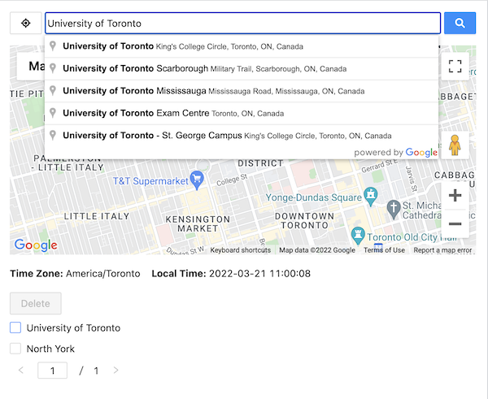
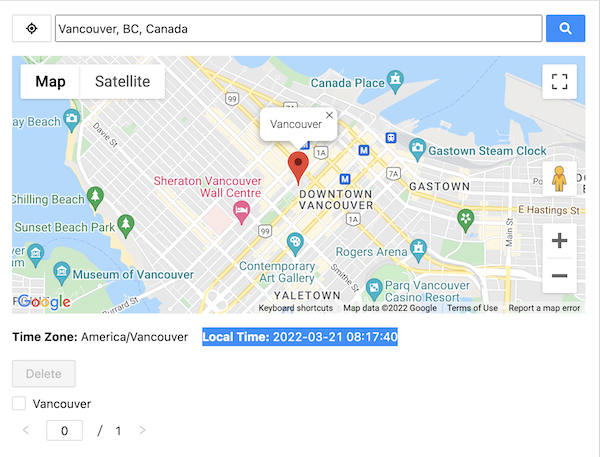

# accuenergy-vue
## Preview 
```



```
## Project Requirements
```
Create a web page includes: 
a. A button to support user location acquisition from browser.
b. A module which allows user to input the name of a location. (Searching feature is triggered by both button click, and press enter key on the keyboard)
c. Display the location on the map and add a marker to each searched location every time when the location is changed.
d. A table with pagination to show all searched places:
  1. It displays a maximum of 10 records on each page.
  2. A checkbox at the beginning of each row to allow user to select multiple records at the same time.
  3. A delete button on the top of it to delete all selected records as well as the marker on the map.
e. Display the time zone and local time of the latest searched location.
You are encouraged to use modern UI Frameworks. (Ant-design preferred)
```
## Project Assumption
```
1. assume using Vue3
2. assume using yarn
3. assume using autocomplete for the search input
4. assume requirement d3 means 'delete records by multi-select
```
## Technical issues
```
1. Pagination: this.currentPage cannot apply to :default-current
2. Not familiar with Vue so didn't break to smaller components 
3. Not sure should use google-map library or pure api
4. Not familiar with production configuration, so this project can only use `yarn serve` to deploy
```
## Project setup
```
yarn install
```
### Compiles and hot-reloads for development
```
yarn serve
```

### Customize configuration
See [Configuration Reference](https://cli.vuejs.org/config/).
